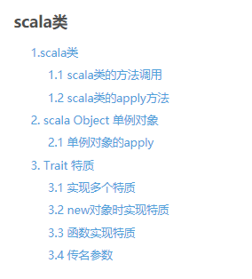

# studyScala
studyScala
## 1.[scala数据类型](https://blog.csdn.net/a18792721831/article/details/103127691)
简单的介绍一些scala的基本语法规则。  

## 2.[Scala学习笔记--基础知识-变量、函数、柯里化、可变长度参数](https://blog.csdn.net/a18792721831/article/details/104009675)
scala的变量和函数相关。  

## 3.[scala类-单例对象-特质](https://blog.csdn.net/a18792721831/article/details/103243552)
scala简单学习scala类、单例对象以及特质  
